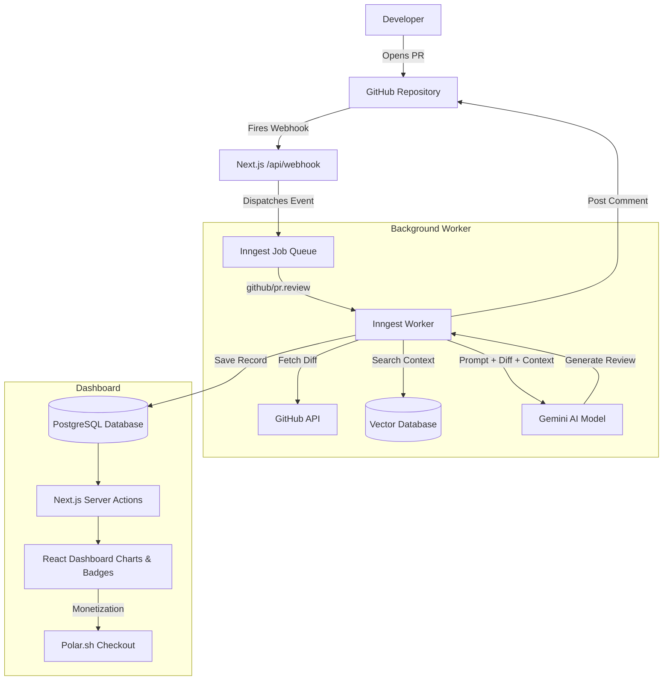

# System Architecture

Reposhield uses a modern, serverless-friendly architecture built on top of Next.js, incorporating background job processing, vector databases, and AI LLMs.

## High-Level Tech Stack
- **Frontend & API**: Next.js (App Router), React, Tailwind CSS, Shadcn UI
- **Authentication**: Better Auth (GitHub OAuth)
- **Database**: PostgreSQL (managed via Prisma ORM)
- **Vector DB**: Pinecone / pgvector (for storing code embeddings)
- **AI/LLM**: Google Gemini (via Vercel AI SDK)
- **Background Jobs**: Inngest
- **Payments**: Polar.sh

## The Data Flow

When a developer opens a Pull Request on GitHub, here is exactly what happens under the hood:

## Key Components

1. **The RAG Engine**: When a repository is linked, Reposhield downloads the code, splits it into chunks, and generates vector embeddings using Gemini. These are saved in the database. When a PR is opened, the background worker fetches the diff, searches the vector database for mathematically similar code chunks, and injects that context into the LLM prompt.
2. **Inngest Workers**: Because AI generation takes time, we cannot block the Next.js HTTP request. Inngest reliably queues the job, handles automatic retries (e.g., if we hit a Gemini rate limit), and executes the AI logic asynchronously.
3. **Dynamic Badging**: The Insights dashboard doesn't store static badges. Instead, it dynamically parses the AI review text for keywords (like "memory leak" or "sql injection") to award developers badges like *Production Hazard Prevented* on the fly.
