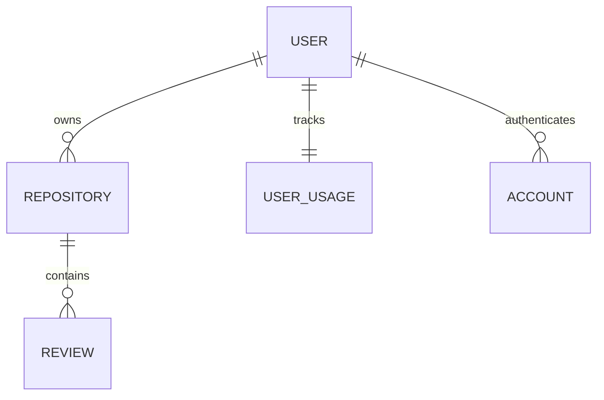

# Database Schema

Reposhield uses PostgreSQL with Prisma ORM. The schema is designed to handle multi-tenant code reviews while strictly enforcing data isolation, high performance, and cascading referential integrity.

## Core Models

### `User`
The central identity model. Tracks the user's basic profile, their authentication status, and their billing tier.
- **`id`**: A string primary key (provided by Better Auth).
- **`subscriptionTier`**: Either `"FREE"` or `"PRO"`. Controls access to features.
- **`polarCustomerId`**: Links the user to their billing profile in Polar.sh for webhook synchronization.
- **`polarSubscriptionId`**: Tracks the specific active subscription.

### `Repository`
Stores metadata about every GitHub repository connected to Reposhield.
- **`githubId`**: The unique `BigInt` ID assigned by GitHub (used to prevent duplicate connections).
- **`fullName`**: Format: `owner/repo`. Used in GitHub API calls.
- **`userId`**: Foreign key to the owner. All access is restricted by this ID.
- **Index Optimization**: Contains an index on `userId` (`@@index([userId])`) to drastically speed up dashboard rendering where a user loads all their connected repos.

### `Review`
Stores the history of every AI-generated code review. Can grow extremely large.
- **`prNumber`**: The GitHub Pull Request ID.
- **`review`**: The full Markdown text generated by the AI. Defined as `@db.Text` to accommodate massive AI responses without character limits.
- **`status`**: `completed`, `failed`, or `pending`. Used to show loading states on the dashboard.
- **Index Optimization**: Contains an index on `repositoryId` (`@@index([repositoryId])`) to quickly fetch review timelines for a specific repo.

### `UserUsage`
A high-performance counter table to track quotas without heavy aggregate queries.
- **`repositoryCount`**: Total number of active repos for the user. Fast O(1) lookup.
- **`reviewCounts`**: A `Json` object tracking how many reviews have been generated for each specific repository (e.g., `{"repo_123": 4}`). We use JSON here to avoid creating a massive, slow-joining pivot table just for rate limiting.

---

## Data Integrity & Cascading Deletes

To prevent orphaned records and maintain a clean database, Reposhield aggressively uses `onDelete: Cascade`.
- If a `User` is deleted, all their `Repository`, `UserUsage`, and `Session` records are automatically deleted.
- If a `Repository` is deleted (disconnected by the user), all associated AI `Review` records are immediately wiped from the database.

---

## Relationships
- **User 1:N Repositories**: A user can connect multiple repos.
- **Repository 1:N Reviews**: A repository has a timeline of reviews.
- **User 1:1 UserUsage**: Every user has exactly one usage tracker.
- **User 1:N Accounts**: Better Auth manages multiple OAuth accounts (GitHub).

---

## Visual ER Diagram (Simplified)

