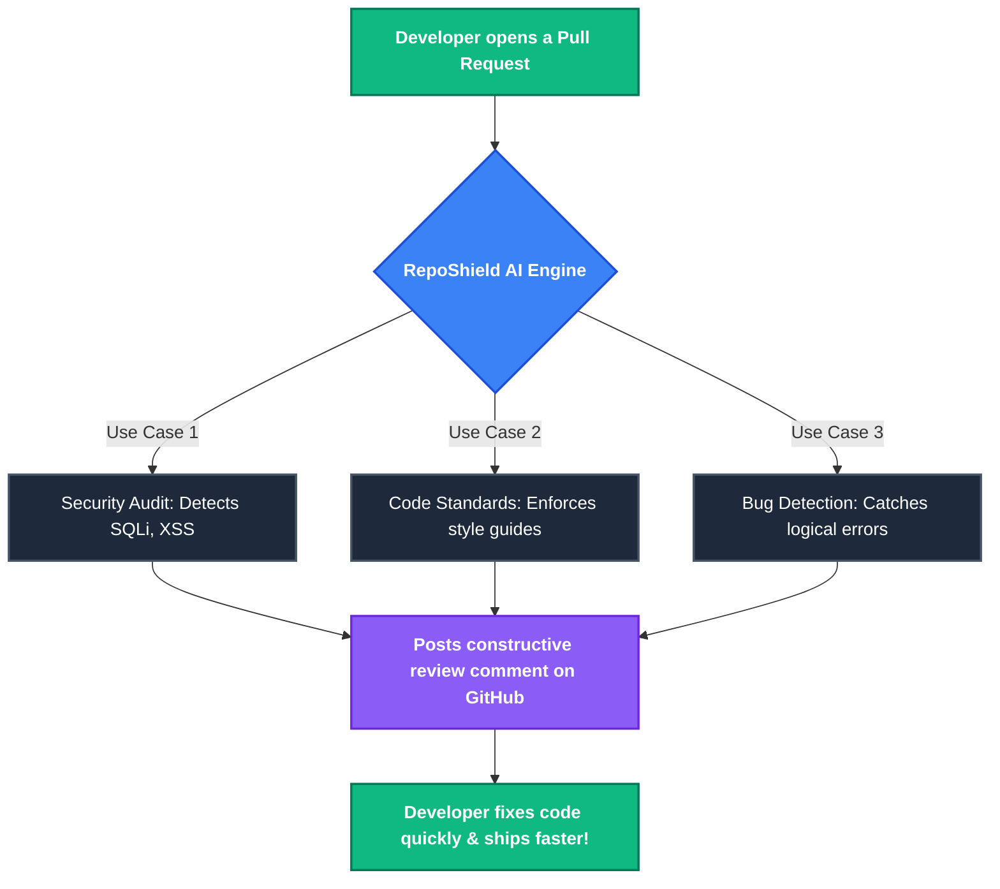

# RepoShield Product Overview (Non-Technical)

This document covers the business logic, product vision, target audience, and non-technical aspects of RepoShield.

## 1. Product Vision & Value Proposition
**Vision:** To democratize access to high-quality code reviews, ensuring that every engineering team, regardless of size, can ship secure, bug-free code quickly.

**Value Proposition:** "Cut Code Review Time & Bugs in Half. Instantly."
RepoShield supercharges development teams by providing immediate, automated AI code reviews on every Pull Request. It acts as an always-on senior engineer that catches bugs, suggests performance improvements, and ensures coding standards are met before human reviewers even look at the code.

## 2. Target Audience
RepoShield is designed for:
- **Solo Developers & Freelancers:** Looking for a "second pair of eyes" to catch mistakes before deploying.
- **Open Source Maintainers:** Dealing with a high volume of PRs from external contributors and needing automated triage and quality checks.
- **Small to Medium Engineering Teams:** Wanting to reduce the bottleneck of senior engineers spending hours reviewing boilerplate or standard logic.
- **CTOs & Engineering Managers:** Seeking actionable insights on team productivity, code quality trends, and repository health over time.

## 3. Pricing Model & Monetization (Polar.sh)
RepoShield uses a freemium SaaS model managed via Polar.sh.

### Free Tier ("FREE")
- **Target:** Individuals and small open-source projects.
- **Limits:** 
  - Maximum of 3 connected GitHub repositories.
  - Maximum of 15 AI pull request reviews per month.
- **Features:** Standard AI reviews, basic dashboard insights.

### Pro Tier ("PRO")
- **Target:** Professional developers and engineering teams.
- **Price:** Managed dynamically in Polar.sh (Product ID: `ffdb0ccf-e07b-4e72-bb5a-ac85f3646e6a`).
- **Limits:** 
  - Unlimited connected GitHub repositories.
  - Unlimited AI pull request reviews.
- **Features:** Priority AI generation, full historical insights, unlimited repository tracking.

## 4. Core User Journey
1. **Onboarding:** User signs in via GitHub (OAuth). The platform immediately syncs their profile.
2. **Setup:** The user visits the `Repositories` tab and clicks "Connect" on the repos they want to monitor.
3. **Action:** A developer opens a Pull Request on a connected repository.
4. **Value Delivery:** RepoShield automatically detects the PR via GitHub Webhooks, processes the code diffs through AI (Google Gemini), and posts a structured, constructive review comment directly on GitHub.
5. **Insights:** The team lead logs into the RepoShield dashboard to view aggregate stats (total reviews, files analyzed, issues caught).

## 5. Brand Voice & Messaging
- **Tone:** Professional, reliable, forward-thinking, and empowering.
- **Design Aesthetic:** Dark mode by default, sleek, minimalistic, and "developer-first." The UI avoids clutter and focuses on actionable metrics.
- **Keywords:** Automated Code Review, AI Pair Programmer, Developer Productivity, Code Quality, Continuous Integration.

## 6. Competitive Advantage
Unlike traditional static analysis tools (e.g., SonarQube) that only look for syntax rules, RepoShield uses Generative AI (RAG with Pinecone & Google Gemini) to understand the *context* and *intent* of the code. It provides human-like feedback, catches logical errors, and suggests refactoring rather than just throwing linting errors.

## 7. User Personas
Understanding who uses RepoShield helps drive feature development and marketing:
- **"The Overwhelmed Maintainer" (Ansh):** Manages a popular open-source repo. Receives 50+ PRs a week from beginners. Needs RepoShield to automatically filter out bad code and provide gentle feedback so Ansh doesn't have to manually review every typo.
- **"The Fast-Paced CTO" (Riya):** Runs a startup with 5 engineers. They don't have time for 3-day review cycles. She buys the **PRO** tier so her team can ship features daily while RepoShield acts as the safety net for security and architecture standards.
- **"The Solo Developer" (Suryansh):** Working on a side hustle. Wants to write enterprise-grade code but doesn't have a senior engineer to pair program with. Uses the **FREE** tier for instant feedback.
- **"The AI Visionary" (Armaan):** Wants to leverage cutting-edge Retrieval-Augmented Generation (RAG) to ensure the entire engineering team stays ahead of the curve. Uses RepoShield to map out complex logic and detect deep vulnerabilities before they ever hit production.

## 8. Go-To-Market (GTM) Strategy
- **Product Hunt Launch:** Initial burst of acquisition targeting early-adopter developers and indie hackers.
- **Open Source Integration:** Offering the FREE tier to popular open-source projects creates a viral loop (every contributor sees the RepoShield bot commenting on their PR, driving brand awareness).
- **Content Marketing:** Publishing case studies on "How Team X reduced their deployment bugs by 40% using RepoShield."

## 9. Key Performance Indicators (KPIs)
To measure the business success of RepoShield, we track:
- **Activation Rate:** Percentage of users who sign up and successfully connect at least one repository.
- **Time-to-Value (TTV):** The time between a user signing up and receiving their first automated AI PR review.
- **Pro Conversion Rate:** The percentage of users who hit the 15-review free limit and upgrade to the Polar.sh PRO tier.
- **Review Latency:** Ensuring the AI posts the review on GitHub within seconds of the PR opening to maintain the "instant" value proposition.

## 10. Future Product Roadmap (Business Alignment)
- **Phase 1 (Current):** Establish core AI review functionality and reliable billing.
- **Phase 2 (Growth):** Team accounts and organizational billing (allowing CTOs to pay for their whole team).
- **Phase 3 (Enterprise):** Custom AI instructions (allowing teams to upload their own internal style guides so RepoShield reviews code strictly according to company-specific rules).
- **Phase 4 (Ecosystem):** IDE Integrations (VS Code extension) to provide RepoShield insights before the PR is even opened.

## 11. Common Use Cases

RepoShield handles the heavy lifting so developers can focus on building features. Here are the most common ways our users rely on the platform:

1. **Automated Security Auditing:** Catching SQL injections, XSS vulnerabilities, and leaked secrets the moment the code is pushed.
2. **Enforcing Coding Standards:** Ensuring junior developers adhere to the company's established style guides and best practices without requiring a senior engineer to manually point out formatting issues.
3. **Accelerating PR Approvals:** Removing the "waiting for review" bottleneck. RepoShield provides the first pass instantly, allowing human reviewers to confidently approve PRs in a fraction of the time.
4. **Reducing Technical Debt:** Detecting logical flaws and suggesting performance optimizations (like adding indexes to database queries or refactoring nested loops).

### Visualizing the Workflow

